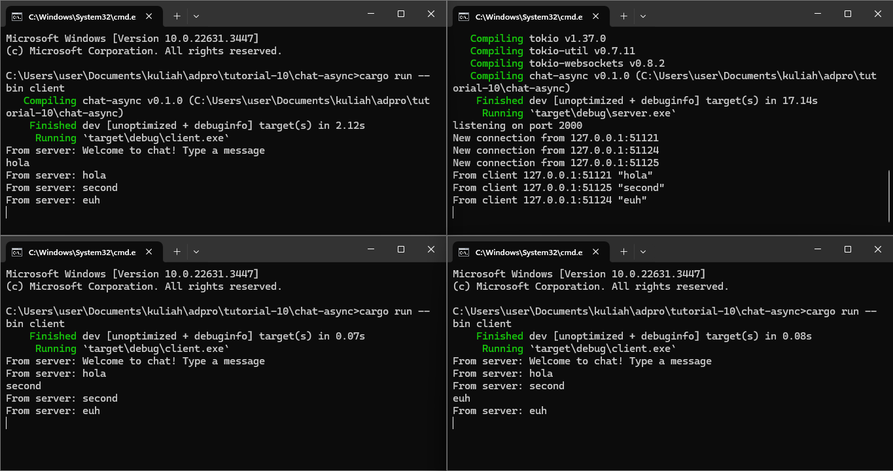
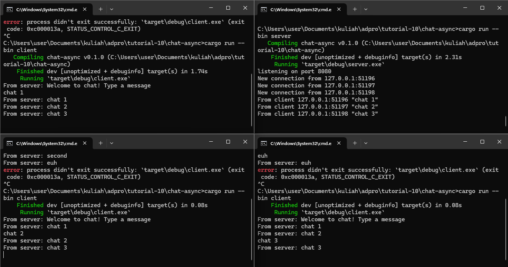

## Original Code

The server side continuously check and accept new connections from clients. Every message received will be sent to all clients currently connected to the server.

## Modifying Port

To modify port, we need to modify in server.rs on this statement:
```
let listener = TcpListener::bind("127.0.0.1:8080").await?;
```
This tells the server to listen in on connections from port 8080, IP 127.0.0.1, TCP protocol.

On the client side, we modify this statement:
```
    let (mut ws_stream, _) =
        ClientBuilder::from_uri(Uri::from_static("ws://127.0.0.1:8080"))
            .connect()
            .await?;
```
This tells the client to stream messages from port 8080 on IP 127.0.0.1 with the protocol ws.

## Shop Client IP and Port


The server sends messages to clients by using the handle_connection function. It takes the client's address as one of its parameters, which includes the client's IP and port.

Before, the server simply sends the client's message to all clients.

```
            msg = bcast_rx.recv() => {
                ws_stream.send(Message::text(format!("{addr:?}: {msg:?}"))).await?;
            }
```

Below, we modify the message to include the client's address that sent the message to the server.
```
            msg = bcast_rx.recv() => {
                ws_stream.send(Message::text(format!("{addr:?}: {msg}", addr = addr, msg = msg?))).await?;
            }
```